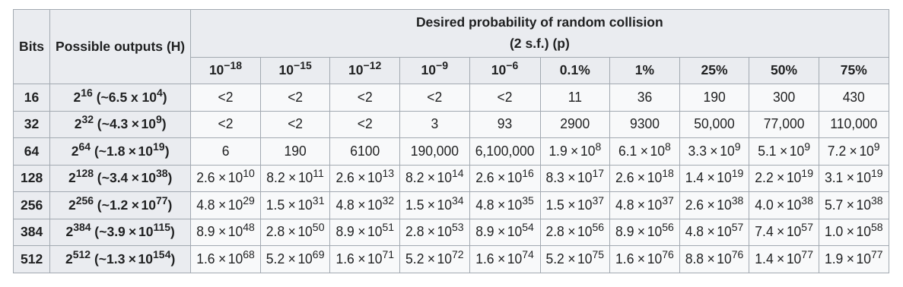

# Hashing
- Hashing is process of converting data - text,files,images etc into fixed length string
- Input -> HashFunction -> Output (hashed data)
- Properties of Hash function 
  - Deterministic : Same input value should generate same hash at any point in time
    - Ideally no two inputs should have same hash value, but hash functions are not 100% perfect, these are known as collisions
    - A good hash function would have less collisions
  - Quick
  - Irreversible : It should be impossible to generate message or file from hashed data
- Use cases :
  - Hashing is a way to authenticate data or show that the data received wasn’t somehow changed along the way. When you’re downloading software, hashing helps ensure that what you’re installing is the original code and not compromised by a virus, trojan, or other malware.
  - Many websites don’t store your actual password in a database but rather your password’s hash value instead. That way, if someone does hack into the database, all they’ll find are hash values that can’t be directly used by themselves.
- Interesting paradox
  - Birthday paradox 
    - There is 100 percent probability if there are 367 people in room to say they have same birthday
    - Also there is 99.9 percent probability with only 70-75 people in room to say they have same birthday
    - Basically number of people reduces drastically, if we dont want to be 100% sure.
    - Using this paradox attackers use relatively smaller input size compared to ```total possible hash combinations``` to generate hash collisions
    
    - In this chart you can see if we use md-5 hashing algorithm which is of 32 bits, we need only 110,000 unique inputs to be 75% sure of generating hash collisions
    - As we increase bits, the input size at 75% probability increases, hence making difficult to generate hash collisions
- Solving Collisions
  - Chaining
  - Open Addressing